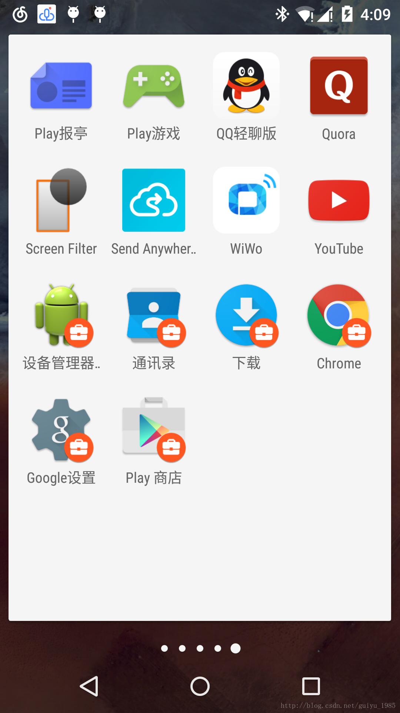
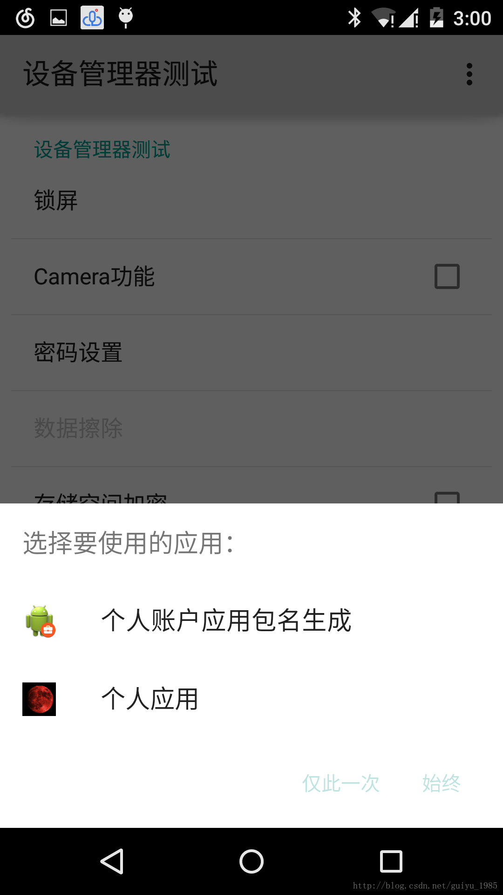

# Lollipop DevicePolicyManager學習（上）

## 簡介

Managed Profile，簡稱被管理者帳戶。這個概念並不是什麼新東西，因為早在4.2版本中，Android就引入了多用戶機制來解決平板使用上的問題。而如今5.0新加入的這個被管理者帳戶功能，可以理解成為是為了解決用戶本人對於應用進行分類的需求問題而做的細化吧。

存在於被管理者帳戶中的應用受制於主帳戶，也就是仍然處於機主本人的控制之下。但這些應用的存儲空間，以及應用的userID和PID都不同於主帳戶的同名應用。

這些在被管理者帳戶中的應用可以由機主進行各方面的限制，比如說控制這些應用不能訪問攝像頭——所有涉及到拍照部分的功能都開啟不了，再比如說控制某些特定應用的功能——比如說讓chrome的歷史記錄功能禁止使用。而所有的這些應用都與主帳戶中的應用隔離，這就意味著原本可能會被無故喚起的某些應用放到這裡之後，它也再也不會被另一些流氓應用給後台喚醒了。

## 前提條件

首先，你需要一台安裝Android5.0及以上版本的手機，親兒子系列最好，因為不知道第三方ROM是否會將「加密」功能給閹割了。

開啟手機加密的方法為：

設置——安全——加密手機

一般來說，手機出廠設置是不預設加密的，需要用戶自己啟動才行。當然，也可以通過代碼來啟動該功能，具體如下：

```java
private voidregisterPovisionManagerProfile() {
        if (null== this) {
           return;
        }
        Intentintent = new Intent(ACTION_PROVISION_MANAGED_PROFILE);
       intent.putExtra(EXTRA_PROVISIONING_DEVICE_ADMIN_PACKAGE_NAME,
               this.getApplicationContext().getPackageName());
        if(intent.resolveActivity(this.getPackageManager()) != null) {
           startActivityForResult(intent, REQUEST_PROVISION_MANAGED_PROFILE);
           this.finish();
        } else {
           Toast.makeText(this, "Device provisioning is not enabled.Stopping.",
                   Toast.LENGTH_SHORT).show();
        }
}
 
 
    @Override
    public voidonActivityResult(int requestCode, int resultCode, Intent data) {
        if(requestCode == REQUEST_PROVISION_MANAGED_PROFILE) {
            if(resultCode == Activity.RESULT_OK) {
               Toast.makeText(getApplicationContext(), "Provisioning done.",Toast.LENGTH_SHORT).show();
            }else {
               Toast.makeText(getApplicationContext(), "Provisioningfailed.", Toast.LENGTH_SHORT).show();
            }
           return;
        }
       super.onActivityResult(requestCode, resultCode, data);
    }
```

之後根據引導窗口則可以完成加密手機並設置Managed Profile的流程。

##具體模組設計相關

對手機加密完成，並生成Managed Profile帳戶之後，我考慮了以下幾個問題。

### 1. 啟動MP帳戶的流程

在google給出的官方樣例中，啟動一個ManagedProfile已經有了一套成熟的方案。

具體如下：

a)        判斷當前應用是否已經註冊為當前帳戶的帳戶所有者（profile owner）——可以理解是擁有某些高級權限，類似admin用戶。

b)        如果不是，則參考加密的流程，發一個系統的intent啟動加密流程。

c)        如果是，那麼恭喜你，你已經處於一個MP中，並且擁有這個MP下的類管理者權限了。

 

參考google的官方樣例BasicManagedProfile即可。

為了方便後續描述，當前應用我簡稱為AdminApp好了。

 

### 2. 如何添加現有應用至MP帳戶中。

一般來說，查詢當前系統中安裝的應用狀態Android已經有了非常方便的方式，通過PackageManager可以查到系統中安裝的各個包的信息總合，也可以指定特定的包名來查詢對應信息。

但是，這個在MP帳戶中是做不到的。

比如常見的getInstalledPackages(intflag)方法，雖然平時調用時僅使用參數flags。但從源碼來看，真實的被調用者其實是被隱藏的方法getInstalledPackages(int flags,int userId)，暴露給我們的方法中，userId已經固定為當前的用戶ID。

再看一下PackageManager服務進程就能知道，真正在查詢安裝包信息時，該方法需要將userID作為校驗條件之一。通常一個Profile下對應的所有應用都有一個相同的userID，所以跨了Profile後就無法查詢主帳戶下的應用信息了。

所以在預設的MP帳戶中操作getInstalledPackages()，如果指明返回非系統應用，則只會返回當前應用本身，其他的三方應用是無法找到的。同樣，查找系統應用也只能查找到在MP帳戶中註冊的系統應用，沒有註冊的同樣也找不到。

因此，如果要添加相關應用至MP帳戶中，無法通過輪詢當前被管理者帳戶下所有的應用名稱來一一添加。目前可行的有兩種方法，一種是用包名字串來激活，另一種是從主帳戶AP來獲取包名激活。

其中，谷歌的官方demo BasicManagedProfile使用的第一種方法，這裡先進行介紹這種方法。如何從主帳戶來獲取留在後面介紹。

還是以Chrome應用為例。

Chrome的包名是：com.android.chrome

通過isApplicationEnabled方法可以判斷當前這個應用並沒有在MP帳戶中。具體的原理就是剛才所說的userID隔離後的查詢的結果。

```java
    /**
     * Checks if the application is availablein this profile.
     *
     * @param packageName The package name
     * @return True if the application isavailable in this profile.
     */
private boolean isApplicationEnabled(String packageName) {
…
}


 

         Android對已知包名的系統應用，提供了將其重新安裝到被管理者帳戶中的方法供AdminApp來調用。即public void enableSystemApp (ComponentName admin, StringpackageName)。

         具體的使用流程可以參考demo中的代碼段：

     /**
    * Enables or disables the specified app in this profile.
    *
    * @param packageName The package name of the target app.
    * @param enabled     Pass true toenable the app.
    */
private voidsetAppEnabled(String packageName, boolean enabled) {
}
```

需要註明的一點是，這個方法只針對擁有INSTALL_PACKAGES權限的系統應用有效，如果你傳入的第三方應用包名，那麼肯定會拋出IllegalArgumentException：Only system apps canbe enabled this way異常。

即使通過反射直接調用PackageManager服務的installExistingPackageAsUser(packageName,userID)方法，也會因為權限的問題而失敗。

所以，手動添加第三方應用到MP中目前我是沒有找到更好的方法，只能在建立MP之後重新安裝指定的第三方應用，此時，MP中會同樣安裝一份拷貝版本。

通過AdminApp調用enableSystemApp使能的系統應用會出現在被管理者帳戶中，作為Launch的圖標顯示出來。:

 

同樣，如果不希望該應用顯示在MP中，可以用AdminApp調用publicboolean setApplicationHidden (ComponentName admin, String packageName, booleanhidden)來隱藏。


簡而言之，通過上述的操作，可以將一個系統應用重新安裝到被管理者帳戶中。之後，你可以對這個被管理者帳戶中的應用進行限制操作了。

### 3.  如何在主帳戶與被管理者帳戶之間做數據通信。
a) 什麼是userID

剛才提到，Lollipop用來區分主帳戶與被管理帳戶的其實是一個**int型數值userID**。

從UserHandler.class可以看到，這個userID是通過對uid作整除得到的：

public static final int PER_USER_RANGE =100000;

[java] view plain copy

```java       
        /** 
         *Returns the user id for a given uid. 
         *@hide 
         */  
       public static final int getUserId(int uid) {  
           if (MU_ENABLED) {  
               return uid / PER_USER_RANGE;  
            }else {  
               return 0;  
            }  
    }  
```
所以100000以內的uid對應的userID都是0，而超過這個數值的再取其整除結果。注意，這個只是Google為了辨識主帳戶與被管理帳戶所做的設計，並不是Unix底層帶上來的參數。


而這個userID的作用剛才也提到了。在service進程對應的方法裡會進行參數校驗，一般來說，只有系統應用才能調用一些涉及到其他profile的方法。

b) 兩個帳戶之前通信的先決條件

由於Profile之間數據通信的相互隔離，導致任何一個Profile中的消息發送只能被自己Profile中的組件所捕獲。這樣一來，雖然從根本上解決了兩個Profile之間因為數據交流所可能產生的隱私暴露的問題，但是也為我們的數據共享帶來了不便。

當然，Google也考慮了這方面的問題，通過一個授權處理方法addCrossProfileIntentFilter()，指定一個用於處理對應消息的Intentfilter，既可以讓被管理者帳戶的消息可以透傳到主帳戶，也可以在被管理者帳戶中接收到主帳戶的消息。

其中的參數FLAG_MANAGED_CAN_ACCESS_PARENT對應前者， FLAG_PARENT_CAN_ACCESS_MANAGED 對應後者。

c) 驗證可行的通信方式

Android常見的組件之間通信的方式無外乎Intent，通過Intent我們可以啟動Activity，Service或者是進行Broadcast等。

但是在兩個Profile之間進行組件的啟動，我只成功嘗試了startActivity一種……

先說startService。Android5.0之後，Google對於startService限制更加嚴格，已經不允許以隱式Intent的方式啟動一個service，不管它是不是本進程的。雖然我在建立Intent物件的同時既指定了service class，也指定了對應的action，但是通過這個action建立的intentfilter仍然無法像Activity那樣被其他Profile對應的Service組件捕獲。

而Broadcast也有同樣的問題，無論是靜態註冊的還是動態註冊，都無法接收到其他Profile發出的廣播信息。

這個實在非常奇怪，如果有人找到瞭解決的辦法務必給我留言，多謝。


至於說通過startActivity的方式來透傳消息，有人可能認為這會造成設計上的不美觀，因為跳轉到其他Profile相關應用都會首先展現一個Activity。這個其實可以解決，在Manifest中對這個跳轉用的activity做一些調整：

[html] view plain copy

```xml
    <activity  
       android:name=".ui.PackageEnabledActivity"  
        <strong>android:theme="@android:style/Theme.NoDisplay</strong>">  
        <intent-filter>  
                        …  
        </intent-filter>  
    </activity>  
```
就可以了，所顯示的Activity完全被隱藏。之後通過這個Activity在啟動此應用所在的Profile的其他組件，就沒有任何的問題。

當兩邊的通信方式確立了之後，可能還存在一個有趣的問題，那就是如何只讓某些Intent透傳到其他Profile而不被本Profile的同名組件所捕獲。
說起來有點繞，舉個簡單的例子就明白了。我們現在知道，當android系統中已經建立被管理者帳戶時，一些應用既可以存在於主帳戶側，又可以在被管理帳戶中有一個同名的拷貝。那麼問題來了，這些應用發給自身某些組件的消息，比如說啟動某個Activity的Intent，如果被允許透傳的話，兩邊Profile的同名應用都會接收到這個Intent，而且會啟動可以處理該Intent的應用列表，就像這樣：



那麼有沒有辦法只讓這個消息傳到其他的Profile中，而本Profile的組件不做處理？

其實很好解決，不需要而且也不可能通過Intent的標誌位來處理，因為這是完全相同的兩個鏡像應用。解決這個問題的辦法是禁用當前Profile中的這個組件就可以了：

[java] view plain copy

```java
    public static void disableCurrentProfileComponent(Context context, Class component, PackageManagerpm) {  
        final ComponentName activity = newComponentName(context, component);  
        pm.setComponentEnabledSetting(activity,  
                PackageManager.COMPONENT_ENABLED_STATE_DISABLED,  
                PackageManager.DONT_KILL_APP);  
```


禁用了當前Profile的這個組件，那麼自然消息只能被對面Profile的同名組件來處理。

PS：當然，還有一個更簡單的方法，就是利用PackageManager.SKIP_CURRENT_PROFILE標誌位來禁止在本Profile內的使用，譬如：

[java] view plain copy

```java
    pm.addCrossProfileIntentFilter(callEmergency,managedProfileUserId, parentUserId,  
                   PackageManager.SKIP_CURRENT_PROFILE);  

```
d) 帳戶之間的大量數據傳輸

解決了兩個Profile之間消息傳輸的方式之後，最後來看如何攜帶大量數據。

這個問題其實不難解決，因為即使Profile之間數據區相互獨立，但是Intent本身是可以通過Bundle來攜帶鍵值對的。只要Intent能夠傳過去，自然也能在對應的Activity組件中解析出Bundle數據來。

但是一旦要透傳某些文件類的數據，比如說圖片或音樂，或者說Profile雙方需要共同維護一個資料庫，比如一個聯繫人庫。這個時候，單靠Bundle就很難完成工作。

所以，Profile之間的數據交互不能僅限於鍵值對的方式，以往的文件類型和資料庫類型的共享仍然要走通才可以。
File類型的數據共享

Google的幫助文檔中提到了用於共享數據文件的方法，這是通過FileProvider庫提供的方法來完成的操作。具體的思路就是：

1）  將待傳輸的文件ContentUri通過FileProvider.getUriForFile()取出來。

2）  把ContentUri與Type通過setDataAndType()加載到Intent中。

3）  一定要在Intent中加上這個Flag——Intent.FLAG_GRANT_READ_URI_PERMISSION，這個Flag決定了Receiver是否具有這個Uri的臨時訪問權限。這點非常重要。

4）  startActivity成功之後，通過getFileDescriptor()方法得到待傳輸文件的文件描述符，之後解析出這個文件即可。


File類型文件傳輸的難點並不是如何從Uri中解析文件，而在於Intent傳輸過程。我查閱的大量資料中都建議在文件的ContentUri獲取之後，通過grantUriPermission()賦予其對應的讀寫權限，但是這個方法是不成的，只有在Intent中加上對應Flag才行。

資料庫類型共享

雖然在Google的幫助文檔中沒有說明不同的Profile可以共享ContentProvider，但是通過文件類型的數據共享可以看出，從原理上說ContentProvider也應是可以共享的，因為FileProvider正式ContentP的一個子類。

關於ContentProvider的共享我走了點彎路，先把解決問題的要點說出來：

使用ContentProvider時我們都會維護一個static常量CONTENT_URI，這個常量一般是由幾部分拼成的：

[java] view plain copy

```java
    //Content Url  
    lic static final Uri CONTENT_URI =Uri.parse("content://" + AUTHORITY + "/item");  
```
通常，需要使用資料庫的其他組件直接解析這個Uri就能得到db文件的確切地址，使用對應的方法就能讀寫資料庫文件。


但是在跨Profile操作時不能這麼做。因為如果直接解析這個常量，得到的只是db文件的相對存儲地址而已，比如說同樣將資料庫保存在應用內部，主Profile可能是

```
/data/data/companyName/databases/*.db，但在被管理Profile裡，則變成了/data/user/11/companyName/databases/*.db。
```

所以即使我們知道db文件的ContentUri，也必須通過Intent攜帶上述臨時訪問權限（Intent.FLAG_GRANT_READ_URI_PERMISSION）發到其他Profile的組件中去。在對方的環境裡解析出正確的db地址來。


至於ContentProvider其他的共享細節與FileProvider無異。只是query數據的時候，記得使用我們Intent攜帶的Uri而不要用static常量直接解析。

 

到此為止，AP與MP之間的通信可以由我們自己完全控制，哪些消息可以通過，哪些消息會被禁止都由我們自己來界定。接下來說說被管理者帳戶中的那些應用都可以做哪些操作。
4. 如何對MP帳戶中的應用進行限制

安裝於MP帳戶中的應用，可以從兩個方面進行限制。

一個是帳戶使用者層面的限制。DevicePlicyManager類提供了一組用來限制被管理者帳戶某些功能的方法addUserRestriction()/clearUserRestriction()，通過給定的key來限制對應帳戶的某些功能。

值得注意的是，這原本不是什麼新功能，為了改善JB多用戶功能的體驗Google在4.3就添加了這個Restrict Profile功能。但是當時的情形是，平板的使用者在主帳戶中對訪客帳戶做某些限制，當平板的使用者切換到一個訪客帳戶時，這些功能就不能再被使用了。而現在的情況是，被管理者帳戶與主帳戶同處於一個Launch裡，可以對被管理者帳戶進行限制但不應該影響到主帳戶的同樣功能。

這個功能比較坑，以限制撥打電話功能為例。如果我不希望訪客帳戶或者被管理者帳戶的應用撥打電話，那麼勢必要在MP帳戶下通過以下方法禁止撥電話功能：

[java] view plain copy

```
    <p>myDeviceManaged.addUserRestriction(myDeviceName,UserManager. DISALLOW_OUTGOING_CALLS)</p>  
```
注意到Android檢查這個disallow標誌是在CallActivity的processOutgoingCallIntent方法中進行的：

[java] view plain copy

```
    privatevoid processOutgoingCallIntent(Intent intent) {  
    ….  
            if(userManager.hasUserRestriction(UserManager.DISALLOW_OUTGOING_CALLS)  
                    &&!TelephonyUtil.shouldProcessAsEmergency(this, handle)) {  
                // Only emergency calls are allowedfor users with the DISALLOW_OUTGOING_CALLS  
                // restriction.  
                        …  
               }  
    }  

```
喚起這個Activity的是Intent.ACTION_CALL，而Google在CrossProfileIntentFiltersHelper中自作主張的為ACTION_CALL添加了SKIP_CURRENT_PROFILE的條件：

[java] view plain copy

```
    publicstatic void setFilters(PackageManager pm, int parentUserId, intmanagedProfileUserId) {  
    …  
    IntentFilter callVoicemail = new IntentFilter();  
           callVoicemail.addAction(Intent.ACTION_DIAL);  
           callVoicemail.addAction(Intent.ACTION_CALL);  
           callVoicemail.addAction(Intent.ACTION_VIEW);  
            callVoicemail.addCategory(Intent.CATEGORY_DEFAULT);  
           callVoicemail.addCategory(Intent.CATEGORY_BROWSABLE);  
           callVoicemail.addDataScheme("voicemail");  
           pm.addCrossProfileIntentFilter(callVoicemail, managedProfileUserId,parentUserId,  
                   PackageManager.SKIP_CURRENT_PROFILE);  
    …  
    IntentFilter smsMms = new IntentFilter();  
           smsMms.addAction(Intent.ACTION_VIEW);  
           smsMms.addAction(Intent.ACTION_SENDTO);  
           smsMms.addCategory(Intent.CATEGORY_DEFAULT);  
            smsMms.addCategory(Intent.CATEGORY_BROWSABLE);  
           smsMms.addDataScheme("sms");  
           smsMms.addDataScheme("smsto");  
           smsMms.addDataScheme("mms");  
           smsMms.addDataScheme("mmsto");  
           pm.addCrossProfileIntentFilter(smsMms, managedProfileUserId,parentUserId,  
                   PackageManager.SKIP_CURRENT_PROFILE);  
    …  
    }  

```
導致這個Activity實際上調用的是AP帳戶中的那個，而我們所做的限制在AP中並不生效。


最終的結論就是，對帳戶所做的限制，也只有在本帳戶內執行的有效，實際調用主帳戶完成的操作並不能實現。

另一個則是應用層面的限制。DevicePolicyManager類同樣提供了一組用來限制被管理者帳戶中具體應用的某些功能的方法setApplicationRestrictions()/getApplicationRestrictions()，該方法是通過指定具體的應用包名，以及一組用於限制應用功能的Bundle串來限制具體的應用功能。

可以看到UserManagerService的實現方法：

  
[java] view plain copy
```

    public voidsetApplicationRestrictions(String packageName, Bundle restrictions,  
              int userId) {  
          if(UserHandle.getCallingUserId() != userId  
                  || !UserHandle.isSameApp(Binder.getCallingUid(),getUidForPackage(packageName))) {  
             checkManageUsersPermission("Only system can set restrictions forother users/apps");  
          }  
          synchronized(mPackagesLock) {  
              if (restrictions == null|| restrictions.isEmpty()) {  
                 cleanAppRestrictionsForPackage(packageName, userId);  
              } else {  
                  // Write therestrictions to XML  
                 writeApplicationRestrictionsLocked(packageName, restrictions, userId);  
              }  
          }  
      
          if(isPackageInstalled(packageName, userId)) {  
              // Notify package ofchanges via an intent - only sent to explicitly registered receivers.  
              Intent changeIntent =new Intent(Intent.ACTION_APPLICATION_RESTRICTIONS_CHANGED);  
             changeIntent.setPackage(packageName);  
             changeIntent.addFlags(Intent.FLAG_RECEIVER_REGISTERED_ONLY);  
             mContext.sendBroadcastAsUser(changeIntent, new UserHandle(userId));  
          }  
```
Google將限制的功能以及對應包名註冊到一個xml文件中，然後重新啟動以限制功能的方式重新喚起這個組件，這個組件在啟動之後會載入用以限制功能的xml，實現限制具體功能的目的。


這個功能出發點本身是非常好的，因為作為被管理者帳戶中的某個單獨應用，很可能存在某些特定的功能需求，比如說不允許使用某些應用特定功能（例如內購），或者是必須打開預設的訪問頁面等。這些功能的實現都有賴於具體的限制方法。但實際上，這個功能又比較難以完成。原因有兩個。


首先，用於限制應用具體功能的Bundle字串是如何獲取的。根據Google官方的參考demoBasicManagedProfile可以瞭解到，Google的系統應用Chrome是如何進行定製的，但是反過來作為非系統層面的開發人員，你該如何獲取Google系統應用具體支持的定製功能串呢？在沒有官方文檔的前提下，我想只能通過反編譯這些應用，通過源碼才能找到具體的功能字串名，以及該如何修改這些功能的方法。


再者，Google系統應用之所以能夠通過這類Bundle鍵值對修改具體的功能，前提是它已經預留好了介面給開發者，讓我們能夠通過setApplicationRestrictions()方法修改具體的應用。如果是沒有預留這些介面的第三方應用，則根本不可能完成這類功能。

所以如果希望對MP帳戶中應用進行限制，目前看起來行之有效的只有對Google的系統應用進行具體功能限制，而對第三方應用而言，只能在帳戶層面上做一些限制而已。

 

最後歡迎所有希望瞭解DevicePolicyManager的人給我留言，我們可以一塊討論並學習這部分功能。

補上出處
[ Lollipop DevicePolicyManager學習（上）](http://blog.csdn.net/guiyu_1985/article/details/42778655)
[ Lollipop DevicePolicyManager學習（下）](http://blog.csdn.net/guiyu_1985/article/details/42968781)